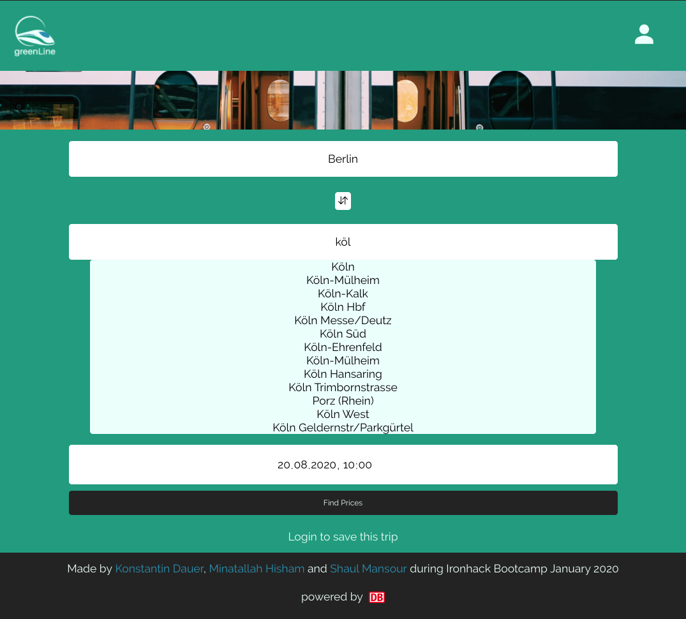
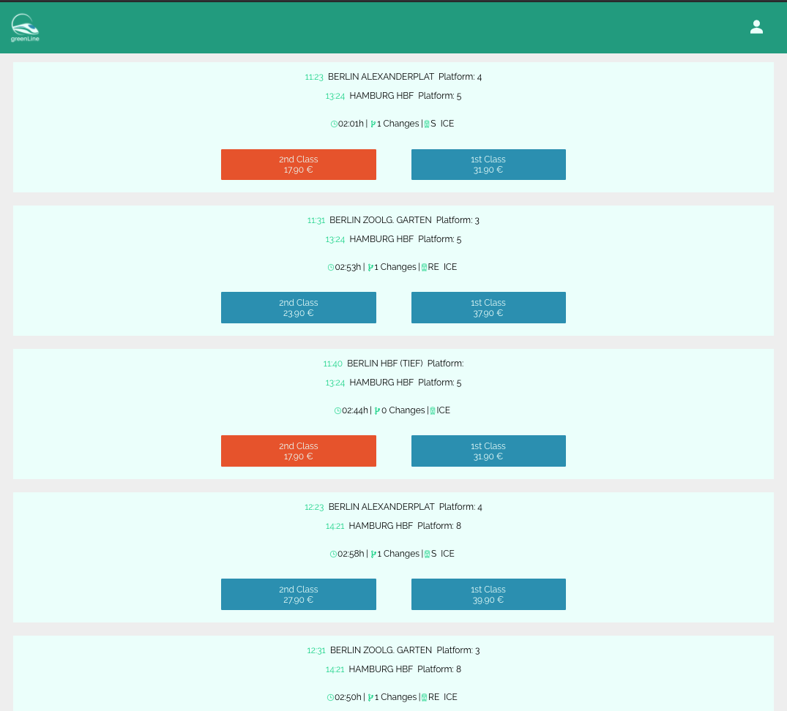
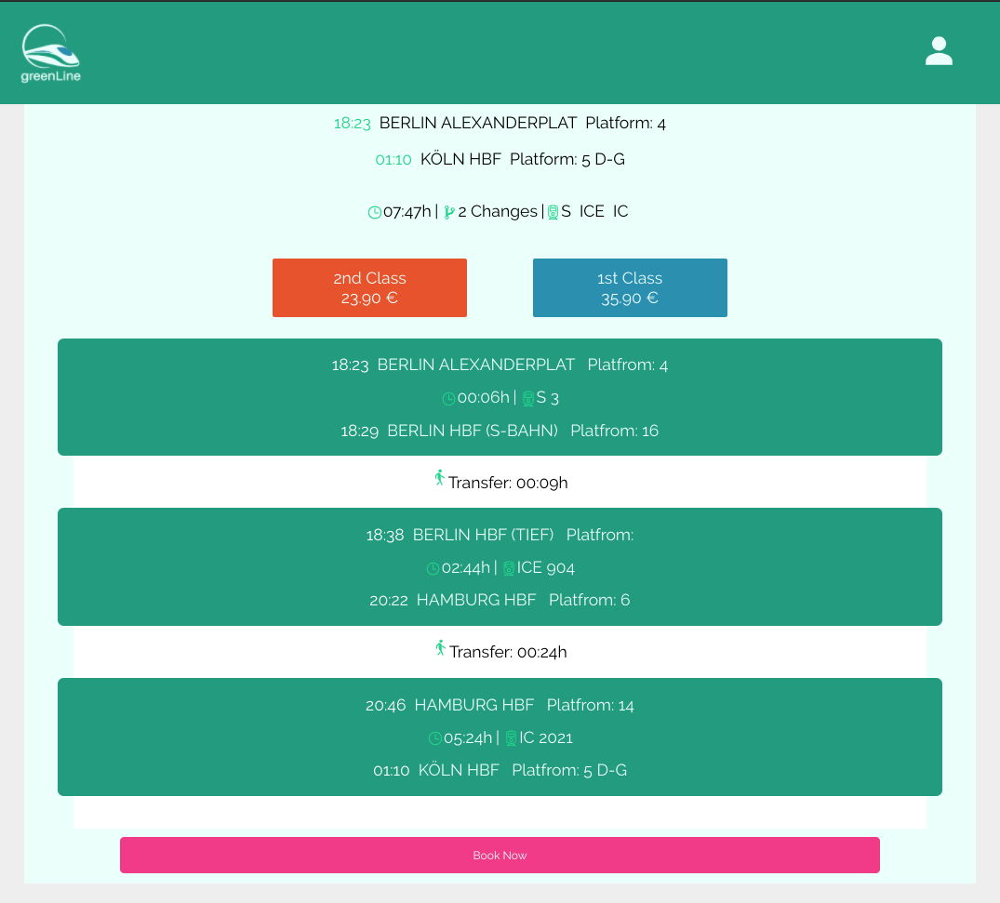

# greenLine
>  Ironhack bootcamp 3rd Project: Full stack React application</br>

A webapp using two Deutsche Bahn APIs [Sparpreise](https://github.com/juliuste/db-prices/) and [Stations](https://github.com/derhuerst/db-stations/) to find cheap train tickets for inter-city travel in Germany.


## Demo
Here is the working live demo : https://green-line.herokuapp.com/
## Table of contents
* [General info](#general-info)
* [Screenshots](#screenshots)
* [Technologies](#technologies-and-dependencies)
* [Setup](#setup)
* [Features](#features)
* [Status](#status)
* [Inspiration](#inspiration)

## General info
greenLine was our first go at creating a full stack MERN web-app. The goal was to create a real-life tool that would allow to find cheep train tickets, to answer the need for a more environment-friendly inter city travel. 🚆

## Screenshots
  

## Technologies and Dependencies
* scss
* react -v 16.8.0
* node.js -v 12.13.1
* express.js -v 4.17.1
* mongoDB -v 3.2.0 /mongoose -v 5.9.2
* passport -v 0.4.1
* axios -v 0.19.2
* bcrypt -v 3.0.8
* uuid -v 7.0.1

## Setup
#### Prerequisites
Install [MongoDB](https://docs.mongodb.com/manual/installation/)</br>
and optionally the MongoDB GUI [MongoDB Compass](https://docs.mongodb.com/compass/master/install/)

#### Installtion
* Fork this repository
* Clone this repository:
```
$ git clone https://github.com/shaulitto/greenLine
```
Install npm packages:
```
$ npm install
```
Create an .env file in the main folder and declare port to "Go Live" in local host.
```
$ touch .env
```
`MONGODB_URI=http://localhost:27017/greenLine
PORT=5555`
#### Seeding of static data
Run to create the DB and seed the stations collection:
```
$ node bin/seeds.js
```
If you now go to [MongoDB Compass](https://docs.mongodb.com/compass/master/install/), you should see the collection and station data.
#### Launching greenLine
Run from main folder
```
$ npm run dev
```
Run from client folder
```
$ npm start
```
## Features
* Search for one way tickets by city or station name
* Get results within a 2 day range
* Sort results by Price or Departure time
* Cheapest prices are Highlighted 
* See details for transfer duration, leg travel duration and train type
* Sign-up as to save favorite trips
* Connect to Deutsche-Bahn ticket booking system
To-do list:
* Create a Calender view to see lowest price for each day
* Add stations in other european countries

## Status
Project is: _no longer continue_ as it was a limited project for the bootcamp

## Inspiration
Project inspired by [Skyscanner](www.skyscanner.com) calendar search </br>
For the real deal check out [Preiskalender](https://bahn.guru/start)</br>
App made with [create-react-app](https://reactjs.org/docs/create-a-new-react-app.html)
